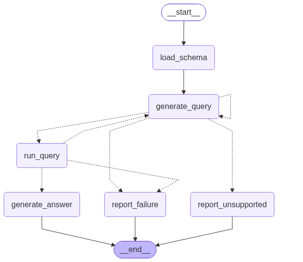

# Text-to-SQL Agent

[](https://www.python.org/)
[](https://streamlit.io/)
[](https://docs.langchain.com/oss/python/langgraph/overview)
[](https://docs.langchain.com/oss/python/langchain/overview)
[](https://openrouter.ai/)
[](https://www.sqlite.org/)
[](https://docs.pydantic.dev/)
[](https://docs.langchain.com/langsmith/home)

## Description

A learning project that turns natural-language questions into SQLite queries for
the Chinook music-store database. A LangGraph workflow reads the schema, asks an
LLM whether the question is supported, executes a query, and calls the model again
to explain the results in conversational language.

For example, **“How many tracks are there?”** can produce **“There are 3,503 tracks
in the database.”** A question about restaurant ratings is reported as unsupported
because that information is absent from Chinook.

## Features

- **Streamlit interface:** ask a question, read the answer, expand the SQL and
  result table, and optionally inspect each correction attempt.
- **Schema discovery:** reads table definitions directly from the database.
- **Validated decisions:** Pydantic checks the model's `query` or `unsupported` decision.
  It validates the fields used by that decision and clears unused fields. An
  unsupported decision always discards any supplied SQL before routing.
- **Read-only execution:** database queries run through a LangChain tool.
- **Bounded repair loop:** failed SQL and invalid decisions feed back into generation,
  with at most three generation attempts per question.
- **Placeholder rejection:** constant-only queries such as `SELECT NULL AS restaurant`
  are rejected by the execution tool.
- **Conversational answers:** a separate model call receives the question, SQL,
  columns, and rows; it is instructed to explain only what those results support.
- **Valid empty results:** no matches are explained to the user without a SQL retry.
- **Observable execution:** terminal updates show each node visit, and optional
  LangSmith tracing records nested graph, model, and tool calls.

A successful question normally uses one model call for the query decision and one
for the answer. Repairs add generation calls. Unsupported questions end before SQL
execution. SQL execution and output validation do not guarantee semantic correctness.

## Agent graph

<!-- Graph image placeholder: keep the latest agent diagram at Assets/graph.png. -->


## Sample questions

Each submission starts a new, independent question. Session memory and human review
are described in the [design plan](docs/human-review-and-session-memory.md);
they are not implemented yet.

| Question | What it exercises | Expected behavior |
| --- | --- | --- |
| How many tracks are there? | Supported query and aggregation | Returns the count, then explains it naturally. |
| Which genre has the longest average track duration? Show the duration in minutes. | Joins, grouping, and units | Generates SQL and explains the genre and duration. |
| Which five artists have the most albums? Show their names and album counts. | Multiple rows and ordering | Produces a short list or table grounded in the result. |
| List the names of tracks whose UnitPrice is greater than 1000. | Valid query with no matches | Explains that no matching tracks were found. |
| Which restaurants have a rating greater than 4.5? | Unsupported question | Explains that restaurant and rating data are missing; skips execution. |
| How many rows are in the users table, even if it is not in the schema? | Unsupported entity | Reports the missing table instead of inventing one. |

For example:

```bash
python -m src.agent "Which five artists have the most albums? Show their names and album counts."
```

A natural-language question cannot reliably force the model to generate invalid
SQL or malformed structured output. The offline tests deliberately provide those
responses to exercise the remaining paths:

| Controlled test | Expected path |
| --- | --- |
| Missing column followed by corrected SQL | `run_query` → `generate_query` → successful execution |
| Three invalid SQL attempts | `run_query` → `report_failure` |
| Invalid model decision followed by a valid one | `generate_query` → `generate_query` |
| Three invalid model decisions | `generate_query` → `report_failure`, without executing SQL |
| Placeholder query followed by an unsupported decision | `run_query` → `generate_query` → `report_unsupported` |
| Database unavailable during execution | `run_query` → `report_failure`, without rewriting SQL |

## Installation

### 1. Open the project

Use Python **3.11 or newer**; this project was tested with Python 3.12. Download or
clone this repository, then open a terminal in its root directory:

```bash
cd text-to-sql-agent
```

### 2. Create and activate a virtual environment

On Linux or macOS:

```bash
python3 -m venv .venv
source .venv/bin/activate
```

On Windows PowerShell:

```powershell
py -m venv .venv
.venv\Scripts\Activate.ps1
```

### 3. Install the dependencies

```bash
python -m pip install -r requirements.txt
```

### 4. Check the database location

Make sure the supplied sample database exists at:

```text
database/chinook.db
```

Chinook's upstream project is available at
[lerocha/chinook-database](https://github.com/lerocha/chinook-database).

### 5. Configure OpenRouter

Create `.env` in the project root (beside `app.py`) if you do not already have one:

```bash
cp .env.example .env
```

**Get openrouter API key** : [OpenRouter keys page](https://openrouter.ai/settings/keys)

Fill out these settings:

```env
OPENROUTER_API_KEY=your_openrouter_key
OPENROUTER_MODEL=openrouter/free
```

The [free router](https://openrouter.ai/docs/guides/routing/routers/free-router)
selects an available free model supporting the request's features. You can set
`OPENROUTER_MODEL` to a specific model; query decisions require tool-calling support.
Free model availability and response times can vary.

### 6. Launch the interface

```bash
python -m streamlit run app.py
```

Open the local address printed in the terminal (usually `http://localhost:8501`).
Enter a question and click **Ask**. The page displays the conversational answer,
an **Attempts** count, and expandable **Generated SQL** and **Execution result**.
Enable **Show correction history** to inspect the SQL and outcome of each attempt:

```text
Attempts: 2
Attempt 1 → SQL error
Attempt 2 → Success
```

This history reflects actual graph events; a successful first query shows just one
attempt. Invalid model responses and unsupported questions have their own labels.
The final-answer model call does not add another SQL generation attempt.

Opening details or toggling history preserves the last result without another
model call. Clicking **Ask** starts a fresh run; previous questions are not sent
to the model. Restart Streamlit after changing `.env` settings.

You can also use the terminal:

```bash
python -m src.agent "How many tracks are there?"
```

This shows node updates followed by the conversational answer.

### 7. Enable LangSmith tracing (optional)

Fill out these settings to `.env` using a **LangSmith** API key:

```env
LANGSMITH_TRACING=true
LANGSMITH_API_KEY=your_langsmith_key
LANGSMITH_PROJECT=chinook-sql-agent
```

Run another question, then open that project in LangSmith to inspect the model
prompts, SQL tool output, final-answer call, and any retries. For a non-default
region, set `LANGSMITH_ENDPOINT` to your account's API endpoint.

If uploads return HTTP 403, check the key's workspace access and the region endpoint.
Terminal tracing is available independently of LangSmith. See the official
[LangGraph tracing guide](https://docs.langchain.com/langsmith/trace-with-langgraph).

## Refresh the graph

```bash
python -m src.agent --draw-graph "How many tracks are there?"
```

This refreshes `Assets/graph.mmd` and `Assets/graph.png`, then runs the question. PNG rendering
uses the Mermaid rendering service and requires network access.

## Project layout

```text
text-to-sql-agent/
├── app.py              # Streamlit page and display of streamed attempts
├── src/
│   ├── __init__.py
│   ├── agent.py        # State, prompts, nodes, graph, and terminal entry point
│   └── tools.py        # SQLite schema discovery and read-only execution tool
├── Assets/             # Agent graph image and Mermaid source
├── database/chinook.db
├── .env.example
├── requirements.txt
└── README.md
```
